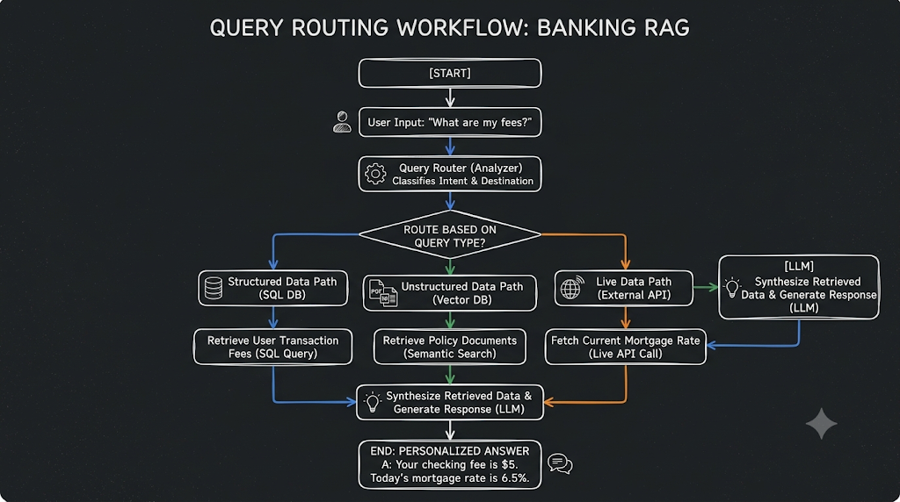
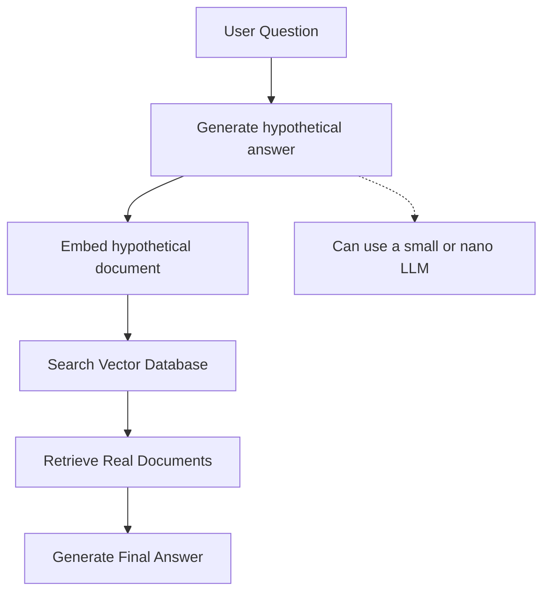
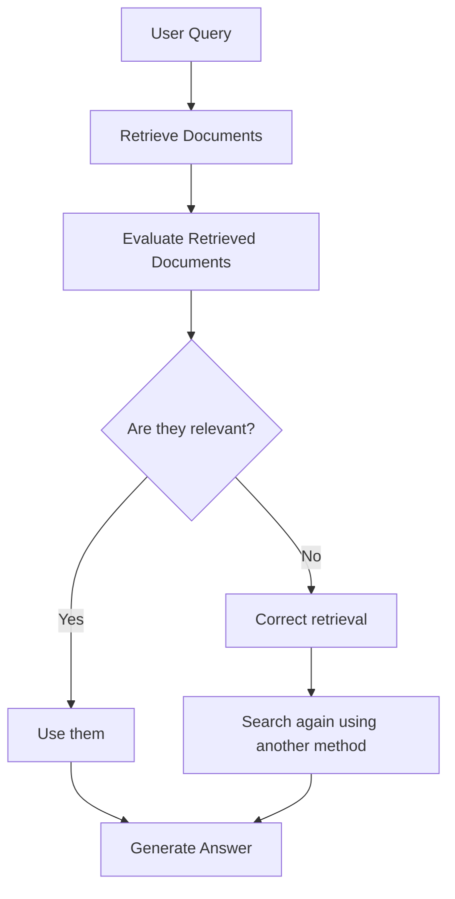
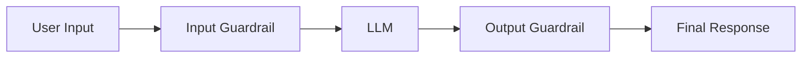
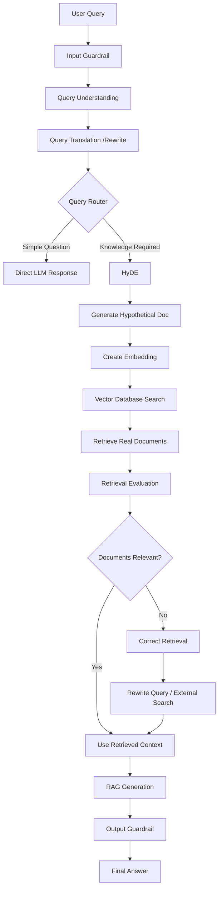
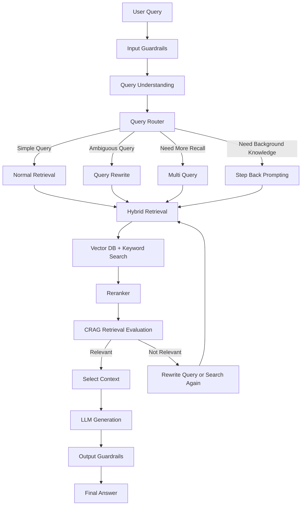

# 🧠 What is Query Translation in RAG?

When a user asks a question, the raw query might be vague, ambiguous, or poorly worded for vector search. **Query Translation** techniques rewrite or expand the query before retrieval to improve the quality of retrieved chunks.

There are 3 main techniques:

| Technique               | What it does                                                                    |
| :---------------------- | :------------------------------------------------------------------------------ |
| **Query Rewriting**     | Rewrites the raw query into a cleaner, more precise version                     |
| **Multi-Query**         | Generates _N_ different phrasings of the query, retrieves for all, deduplicates |
| **Step-Back Prompting** | Generates a more abstract/general "parent" question to broaden context          |

---

## 🔍 How Each Technique Works

> **Demo query used:** `"virtual team problems"` — intentionally vague to highlight the value of query translation.

---

### Technique 1 — Query Rewriting

The LLM rewrites the short, vague query into a detailed, semantically rich sentence before hitting the vector store. This dramatically improves cosine similarity matching.

```
Original  : virtual team problems
Rewritten : challenges faced by virtual teams in remote work environments,
            including communication issues, collaboration difficulties, and
            team cohesion problems
```

**How it works (step by step):**

1. Send the raw query to the LLM with a rewriting prompt.
2. Use the **rewritten query** (not the original) to retrieve chunks from the vector store.
3. Pass the retrieved chunks + rewritten query to the LLM for the final answer.

**Best for:** Vague, short, or keyword-style queries that need more precision.

---

### Technique 2 — Multi-Query (Query Expansion)

Generates N alternative phrasings of the same question, retrieves chunks for **each**, then deduplicates and merges before answering. This casts a wider net across the vector space.

```
Generated 3 alternatives:
  1. challenges faced by remote teams
  2. issues encountered in virtual collaboration
  3. difficulties in managing distributed teams

Retrieved 9 total chunks → 5 unique after deduplication
```

**How it works (step by step):**

1. Ask the LLM to generate N rephrased versions of the query.
2. Run retrieval **in parallel** for all N queries.
3. **Deduplicate** by `pageContent` to avoid repeating the same chunk.
4. Feed the merged unique chunks to the LLM for a richer answer.

**Best for:** Queries where a single phrasing might miss relevant chunks expressed differently in the source document.

---

### Technique 3 — Step-Back Prompting

Generates a more **abstract, general** version of the query (a "step-back" question) to retrieve broader background context, then combines it with the specific query's results.

```
Original    : virtual team problems
Step-Back   : What are the common challenges faced by teams that operate
              remotely or in a virtual environment?

Specific retrieval : 3 chunks
Step-back retrieval: 3 chunks
Merged unique      : 4 chunks
```

**How it works (step by step):**

1. Ask the LLM to generate a broader, more conceptual version of the question.
2. Run retrieval **in parallel** for both the original and the step-back query.
3. Merge and deduplicate the results.
4. Pass both questions and the merged context to the LLM for a well-grounded, comprehensive answer.

**Best for:** Narrow queries that miss conceptual or background context present elsewhere in the document.

---

## 🧠 Mental Model

```
Naive RAG:
  Raw Query ──▶ Retriever ──▶ LLM ──▶ Answer

With Query Translation:
  Raw Query ──▶ LLM (rewrite/expand/abstract)
                    │
                    ▼
             Better Query(ies) ──▶ Retriever ──▶ Merged Chunks ──▶ LLM ──▶ Answer
```

---

## 📊 When to Use Which Technique

| Technique           | Best For                                      | Retrieval Width                 |
| :------------------ | :-------------------------------------------- | :------------------------------ |
| Query Rewriting     | Vague / short / keyword-style queries         | Single query                    |
| Multi-Query         | Queries with many valid alternative phrasings | Wide (N queries)                |
| Step-Back Prompting | Narrow queries needing conceptual background  | Two-level (specific + abstract) |

> **Implementation:** See [`day6-Advance-RAG/query-rewriting/query-translation.js`](./day6-Advance-RAG/query-rewriting/query-translation.js)

### Query routing

Query routing is an advanced RAG technique that directs user queries to the most appropriate retrieval path or data source based on the query's characteristics, rather than using a static, one-size-fits-all approach.

##### a real-world scenario: a customer support AI for a large bank

When a customer asks a question, the bank's system cannot just dump all internal documents into one giant database; the data is stored in different formats and places depending on security, structure, and update frequency.

| User Query 💬                                                        | Route Destination 🎯                 | Why This Route? 🤔                                                                                                                                        |
| :------------------------------------------------------------------- | :----------------------------------- | :-------------------------------------------------------------------------------------------------------------------------------------------------------- |
| "What are my current checking account transaction fees?" 💳          | **SQL Database** 🗄️                  | Structured data (user accounts, specific fees) is best queried directly from relational databases using precise queries rather than semantic text search. |
| "How do I set up a recurring international wire transfer?" 🌍        | **Vector Database (PDF Manuals)** 📄 | Unstructured instructions require semantic search through official policy documents and help guides.                                                      |
| "What is the current 30-year fixed mortgage interest rate today?" 📈 | **Live API / External Service** ⚡   | Real-time data changes constantly and cannot be reliably pulled from static documents stored in a vector database.                                        |



### HyDE

HyDE (Hypothetical Document Embeddings) is a retrieval technique used in RAG to improve document retrieval when a user's query doesn't closely match the wording of the documents in the knowledge base.

Instead of directly embedding the user's question, we first use an LLM to generate a hypothetical answer or document based on that question. We then create an embedding from this generated document and use that embedding to search the vector database

#### HyDE RAG Workflow Diagram



#### C-RAG(Corrective - RAG)

Corrective RAG is an advanced RAG technique that improves normal RAG by checking whether the retrieved documents are actually useful and correcting the retrieval if they are not.

we assume retrieved documents are relevant, but retrieval can sometimes return incorrect or low-quality results. CRAG uses a retrieval evaluator to assess document relevance

#### CRAG Workflow Diagram



#### **Guardrails**

Guardrails are like security gates around an LLM. They check what goes into the model, what comes out of the model, and sometimes what actions the model is allowed to take.

Guardrails are mechanisms used to control and monitor LLM behavior. They ensure that the model receives valid inputs, follows application rules, and produces safe and reliable outputs. In an LLM application, guardrails can be applied at different stages, such as input validation, retrieval filtering, output checking, and controlling agent actions

**Why do we need guardrails?**

LLMs are powerful, but they can:

- Generate incorrect information (hallucinations)
- Reveal sensitive data
- Answer questions outside their intended purpose
- Follow malicious instructions from users
- Produce unsafe or inappropriate content

#### LLM Guardrails Flow



#### Advanced RAG Complete Workflow 1 Approach



#### Advanced Production RAG Architecture approach 2


